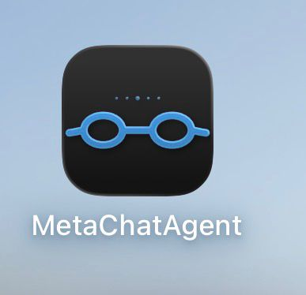
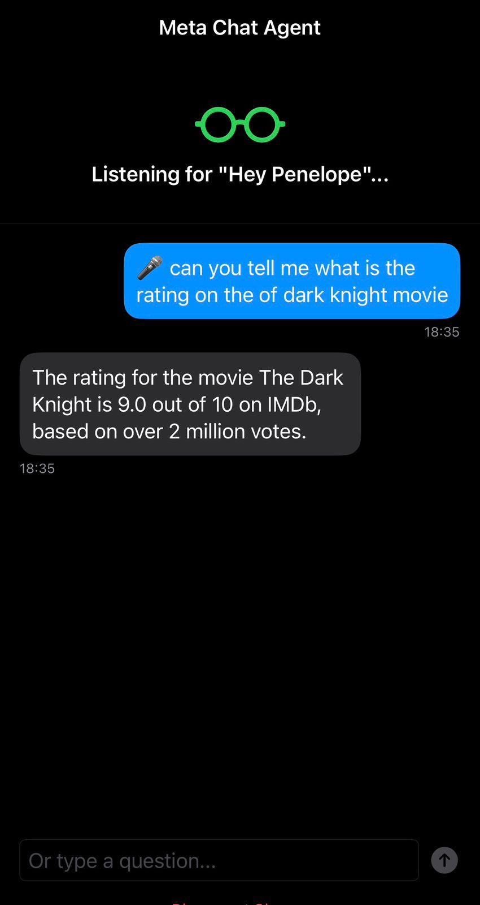
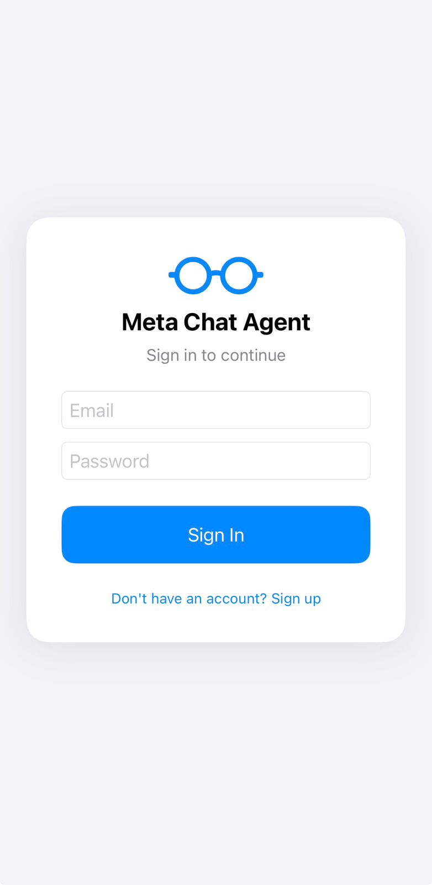

# Ray-Ban Meta AI Voice Agent — Amazon Bedrock AgentCore

> ⚠️ **Disclaimer:** The iOS code in this project was built with the assistance of [Kiro](https://kiro.dev), an agentic AI IDE, to bridge a gap in Swift/iOS expertise. This is a demo project — it is not intended for production use.

Hands-free AI assistant for [Meta Ray-Ban smart glasses](https://www.meta.com/smart-glasses/) powered by [Amazon Bedrock AgentCore](https://docs.aws.amazon.com/bedrock-agentcore/latest/devguide/what-is-bedrock-agentcore.html?trk=87c4c426-cddf-4799-a299-273337552ad8&sc_channel=el) and [Strands Agents](https://strandsagents.com). Say a wake word, ask anything — the agent responds through the glasses speakers.

[](https://aws.amazon.com/cdk/)
[](https://swift.org)
[](https://strandsagents.com)
[](https://docs.aws.amazon.com/bedrock-agentcore/latest/devguide/what-is-bedrock-agentcore.html)

<p align="center">
  
  &nbsp;&nbsp;&nbsp;&nbsp;
  
  &nbsp;&nbsp;&nbsp;&nbsp;
  
</p>

---

## What This Does

Voice-controlled AI agent that runs on Meta Ray-Ban glasses. The agent uses wake word detection, processes natural language queries, and speaks responses directly through the glasses speakers — no need to touch the phone.

```
Say "Hey Penelope"
  → Glasses confirm "Ready"
  → Ask your question
  → Agent responds through glasses speakers
```

The agent has access to web search, IMDb ratings, GitHub repository search, notes (Obsidian), and math. Supports [Amazon Bedrock](https://aws.amazon.com/bedrock/?trk=87c4c426-cddf-4799-a299-273337552ad8&sc_channel=el), [Anthropic](https://www.anthropic.com/), and [OpenAI](https://openai.com/) as model providers. Users authenticate via [Amazon Cognito](https://aws.amazon.com/cognito/?trk=87c4c426-cddf-4799-a299-273337552ad8&sc_channel=el) — the API is fully protected, no API keys stored on the device.

---

## Agent Tools

| Tool | What it does |
|------|-------------|
| `tavily` | Web search — current events, news, facts, any internet query |
| `search_imdb` | Movie and TV show ratings, cast, director, plot from IMDb |
| `search_github_repos` | Find GitHub repositories by topic, language, or keyword |
| `search_github_code` | Find code examples on GitHub |
| `save_to_obsidian` | Save ideas as structured Markdown notes to an S3-backed Obsidian vault |
| `calculator` | Math and unit conversions |
| `current_time` | Current date and time |
| `think` | Complex reasoning before answering |
| `http_request` | Call public APIs directly |
| `browser` | Navigate dynamic websites when needed |

---

## Memory Architecture

The agent uses two layers of memory following STM/LTM principles:

**Short-Term Memory (STM)** — conversation context within a session, powered by [Amazon Bedrock AgentCore Runtime isolated sessions](https://docs.aws.amazon.com/bedrock-agentcore/latest/devguide/agents-tools-runtime.html?trk=87c4c426-cddf-4799-a299-273337552ad8&sc_channel=el). A new session starts each time the glasses connect; all messages in that connection share context.

**Long-Term Memory (LTM)** — user facts and preferences that persist across all sessions, powered by [AgentCore Memory](https://docs.aws.amazon.com/bedrock-agentcore/latest/devguide/memory.html?trk=87c4c426-cddf-4799-a299-273337552ad8&sc_channel=el). The agent learns your name, location, and preferences over time without any explicit action from you.

---

## Security

- **Authentication**: [Amazon Cognito](https://aws.amazon.com/cognito/?trk=87c4c426-cddf-4799-a299-273337552ad8&sc_channel=el) User Pool — users sign up with email, verify with code, and authenticate via JWT tokens
- **Token storage**: iOS [Keychain](https://developer.apple.com/documentation/security/keychain_services) — never UserDefaults
- **API secrets**: [AWS Systems Manager (SSM) Parameter Store](https://docs.aws.amazon.com/systems-manager/latest/userguide/systems-manager-parameter-store.html?trk=87c4c426-cddf-4799-a299-273337552ad8&sc_channel=el) SecureString — never in CloudFormation or code
- **Session**: RefreshToken valid for 10 years — session persists across app restarts and phone locks
- **API**: Protected by Amazon Cognito authorizer — no request reaches the backend without a valid JWT

---

## Components

| Folder | Description |
|--------|-------------|
| `meta-agentcore-chat/backend/` | [AWS Cloud Development Kit (CDK)](https://aws.amazon.com/cdk/?trk=87c4c426-cddf-4799-a299-273337552ad8&sc_channel=el) stack — [Amazon API Gateway](https://aws.amazon.com/api-gateway/?trk=87c4c426-cddf-4799-a299-273337552ad8&sc_channel=el), [AWS Lambda](https://aws.amazon.com/lambda/?trk=87c4c426-cddf-4799-a299-273337552ad8&sc_channel=el), AgentCore Runtime, Amazon Cognito, [Amazon DynamoDB](https://aws.amazon.com/dynamodb/?trk=87c4c426-cddf-4799-a299-273337552ad8&sc_channel=el), Memory |
| `meta-agentcore-chat/ios/` | SwiftUI iOS app — voice commands, wake word, Cognito auth |
| `meta-agentcore-chat/backend/agent_files/` | Strands agent with tools |
| `meta-agentcore-chat/update_ios_config.py` | One-command deploy and iOS config update |

---

## Model Providers

The agent supports three providers. Priority: **Anthropic → OpenAI → Amazon Bedrock (default)**.

| Provider | How to activate | Default model |
|----------|----------------|---------------|
| **Amazon Bedrock** | Default, no extra config | `anthropic.claude-3-haiku-20240307-v1:0` — change with `-c model_id=...` |
| **Anthropic** | Pass `anthropic_api_key` | `claude-opus-4-6` |
| **OpenAI** | Pass `openai_api_key` | `gpt-4o` |

To switch providers without redeploying:

```bash
source meta-agentcore-chat/backend/.venv/bin/activate

# Use Anthropic
python meta-agentcore-chat/update_ios_config.py --skip-deploy -c anthropic_api_key="sk-ant-..."

# Use OpenAI
python meta-agentcore-chat/update_ios_config.py --skip-deploy -c openai_api_key="sk-..."

# Back to Bedrock: remove the key from AWS SSM Parameter Store console
```

Secrets are stored as [SSM Parameter Store SecureString](https://docs.aws.amazon.com/systems-manager/latest/userguide/systems-manager-parameter-store.html?trk=87c4c426-cddf-4799-a299-273337552ad8&sc_channel=el) — never in CloudFormation or code.

---

## Deploy

The setup requires two deployments:

**First deploy** — without iOS-specific values (get the outputs first):

```bash
cd meta-agentcore-chat/backend
python3 -m venv .venv && source .venv/bin/activate
pip install -r requirements.txt
cd ..

source backend/.venv/bin/activate
python update_ios_config.py \
  -c tavily_api_key="tvly-..." \
  -c anthropic_api_key="sk-ant-..."   # or openai_api_key, omit for Bedrock
```

After the first deploy, note the outputs:
- `UniversalLinkDomain` — needed for Meta Developer Center registration (see full guide)

**Second deploy** — after registering on Meta Developer Center, add iOS values:

```bash
python update_ios_config.py \
  -c team_id="YOUR_APPLE_TEAM_ID" \
  -c bundle_id="com.example.YourApp" \
  -c obsidian_bucket="your-s3-bucket" \
  -c tavily_api_key="tvly-..." \
  -c anthropic_api_key="sk-ant-..."
```

This updates the Lambda with Universal Link config and refreshes `AppConfig.swift` with the Cognito values needed by the iOS app.

Full setup guide: [meta-agentcore-chat/README.md](meta-agentcore-chat/README.md)

---

## References

- [Amazon Bedrock AgentCore](https://docs.aws.amazon.com/bedrock-agentcore/latest/devguide/what-is-bedrock-agentcore.html?trk=87c4c426-cddf-4799-a299-273337552ad8&sc_channel=el)
- [Strands Agents Framework](https://strandsagents.com)
- [Meta Wearables Developer Center](https://wearables.developer.meta.com/)
- [Meta DAT iOS SDK](https://github.com/facebook/meta-wearables-dat-ios)

---

## Contributing

Contributions are welcome! See [CONTRIBUTING](CONTRIBUTING.md) for more information.

---

## Security

If you discover a potential security issue in this project, notify AWS/Amazon Security via the [vulnerability reporting page](http://aws.amazon.com/security/vulnerability-reporting/?trk=87c4c426-cddf-4799-a299-273337552ad8&sc_channel=el). Please do **not** create a public GitHub issue.

---

## License

This library is licensed under the MIT-0 License. See the [LICENSE](LICENSE) file for details.
