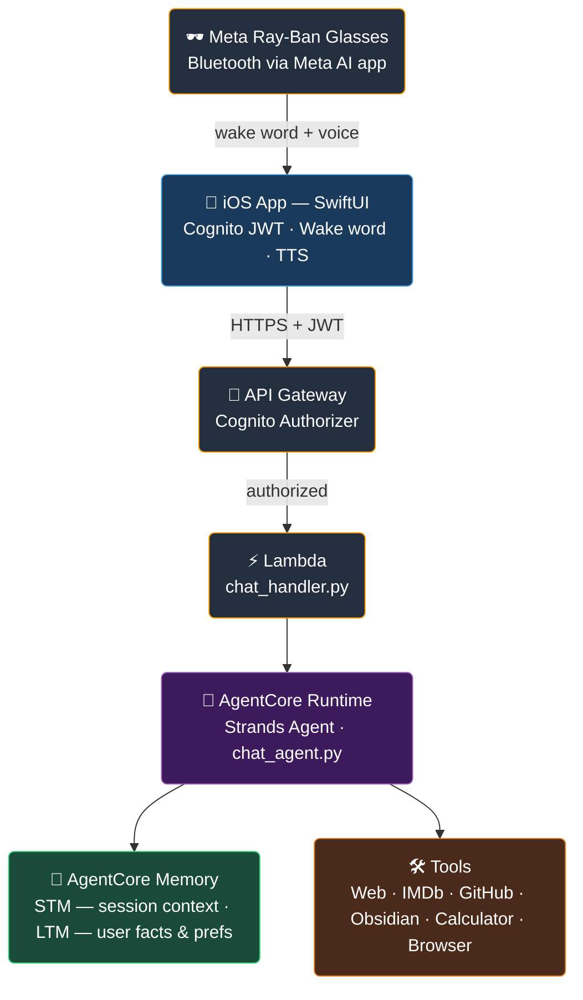
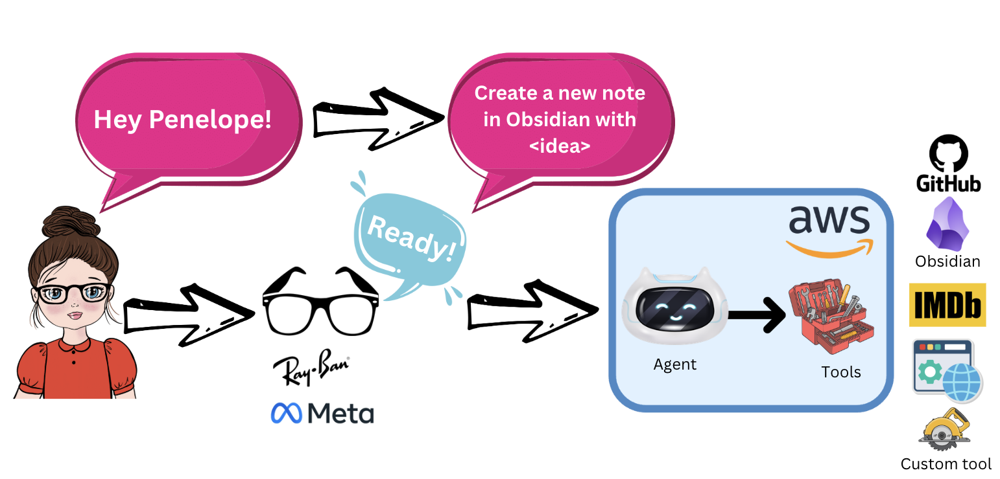
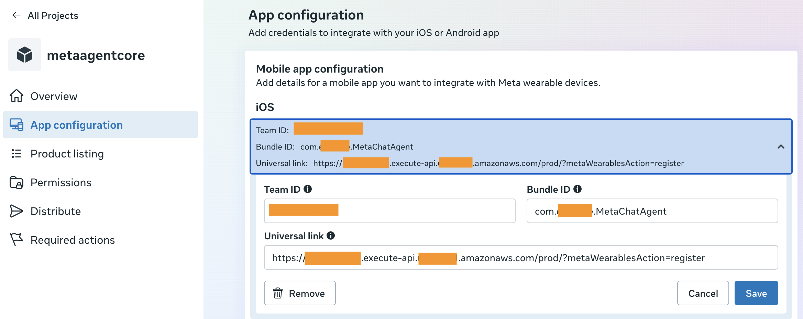
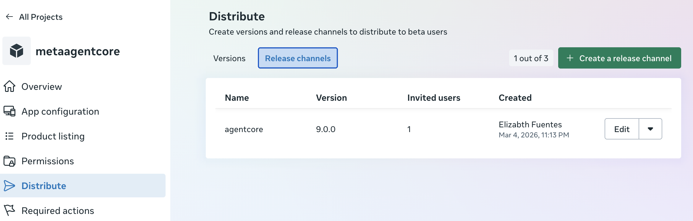
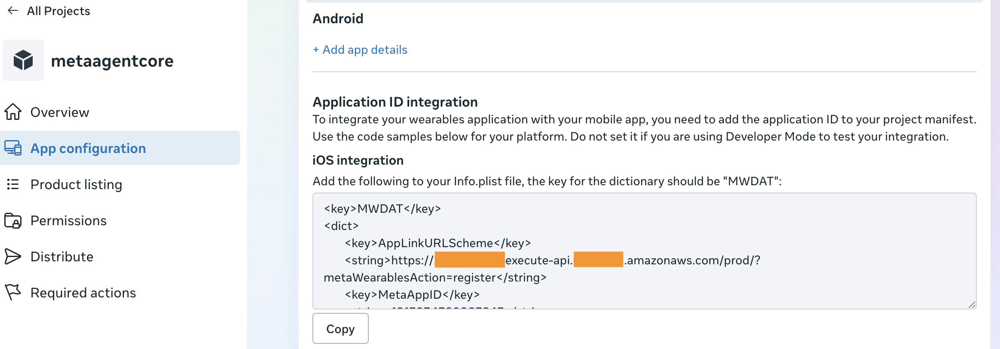
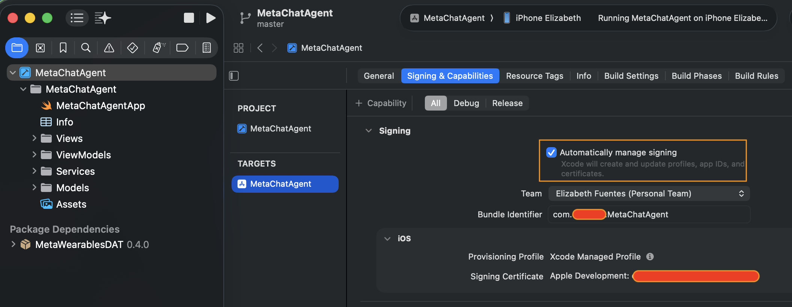

# Hands-Free AI Voice Agent for Meta Ray-Ban Glasses — Amazon Bedrock AgentCore

[](https://aws.amazon.com/cdk/)
[](https://swift.org)
[](https://strandsagents.com)
[](https://docs.aws.amazon.com/bedrock-agentcore/latest/devguide/what-is-bedrock-agentcore.html)

> ⚠️ **Disclaimer:** The iOS code in this project was built with the assistance of [Kiro](https://kiro.dev), an agentic AI IDE, to bridge a gap in Swift/iOS expertise. This is a demo project — it is not intended for production use.

Conversational AI assistant powered by [Amazon Bedrock AgentCore](https://docs.aws.amazon.com/bedrock-agentcore/latest/devguide/what-is-bedrock-agentcore.html?trk=87c4c426-cddf-4799-a299-273337552ad8&sc_channel=el) with Meta Ray-Ban smart glasses integration. Say a wake word, ask anything, hear the answer through the glasses speakers — hands-free.

<p align="center">
  
  &nbsp;&nbsp;&nbsp;&nbsp;
  
  &nbsp;&nbsp;&nbsp;&nbsp;
  
</p>

---

## Architecture



---

## Voice Flow

<p align="center">
  
</p>

> 💡 Silent for 6 seconds after "Ready"? The agent returns to listening mode automatically. Works with the screen off — requires Background Audio capability in Xcode.

---

## Memory Architecture — STM and LTM

The agent uses two layers of memory following best practices for conversational AI. See: [Add memory to your AgentCore agent](https://docs.aws.amazon.com/bedrock-agentcore/latest/devguide/memory.html?trk=87c4c426-cddf-4799-a299-273337552ad8&sc_channel=el)

### Short-Term Memory (STM) — Conversation Context

**What it is:** The context of the current conversation — what was said in THIS session.

**How it works:** Managed by the [AgentCore Runtime `runtimeSessionId`](https://docs.aws.amazon.com/bedrock-agentcore/latest/devguide/agents-tools-runtime.html?trk=87c4c426-cddf-4799-a299-273337552ad8&sc_channel=el). All messages sharing the same `sessionId` maintain conversation context. When you ask a follow-up question, the agent knows what was discussed before.

**Lifecycle:**
- A new UUID is generated each time `AgentView` appears (glasses connect)
- All voice interactions within that connection use the same `sessionId`
- When the glasses disconnect, the session ends — context is cleared
- Reconnecting starts a fresh conversation

```
Glasses connect → sessionId = "ioschat-a1b2c3-550e8400-e29b-41d4..."
  "What movies are in Miami?" ──┐
  "What time is the second one?" ──┘  Same session, agent remembers
Glasses disconnect → session ends, context cleared
Glasses reconnect → new UUID → fresh conversation
```

**Where the value comes from:** Generated in `AgentView.swift` as `UUID().uuidString` at view initialization. Sent to the Lambda in the request body as `session_id`. The Lambda prefixes it: `ioschat-{userId[:8]}-{uuid}` for traceability.

> See: [Use isolated sessions for agents](https://docs.aws.amazon.com/bedrock-agentcore/latest/devguide/agents-tools-runtime.html?trk=87c4c426-cddf-4799-a299-273337552ad8&sc_channel=el)

---

### Long-Term Memory (LTM) — Persistent User Knowledge

**What it is:** Facts and preferences about the user that persist across all sessions indefinitely.

**How it works:** Powered by [AgentCore Memory Store](https://docs.aws.amazon.com/bedrock-agentcore/latest/devguide/memory.html?trk=87c4c426-cddf-4799-a299-273337552ad8&sc_channel=el), keyed by the user's `actorId`. The agent automatically reads relevant memories at the start of each session and writes new ones at the end — no explicit user action required.

| Memory Type | Namespace | What it stores |
|-------------|-----------|----------------|
| **Semantic** | `/users/{actorId}/facts` | Facts the user shares — "I live in Miami", "I work at AWS" |
| **User Preference** | `/users/{actorId}/preferences` | Learned preferences — "prefers short answers", "speaks Spanish" |

**Retention:** 90 days. Survives disconnections, app restarts, and new conversations.

```
Session 1: "I'm a software engineer in Miami"
  → LTM stores: {fact: "software engineer", location: "Miami"}

Session 2 (next day, new sessionId):
  "What tech meetups are near me?"
  → Agent reads LTM → knows user is in Miami → gives relevant answer
```

**Where the value comes from:** The `actorId` is derived from the Cognito user's `sub` — a UUID assigned by Cognito at account creation that never changes. The Lambda extracts it from the Cognito JWT claims: `claims.get("sub")`. It is prefixed as `ioschat:{cognitoSub}` to namespace it per app.

To get your Cognito `sub`:
```bash
aws cognito-idp get-user \
  --access-token <your-access-token> \
  --region <your-region> \
  --query 'UserAttributes[?Name==`sub`].Value' \
  --output text
```

> See: [AgentCore Memory](https://docs.aws.amazon.com/bedrock-agentcore/latest/devguide/memory.html?trk=87c4c426-cddf-4799-a299-273337552ad8&sc_channel=el) · [Cognito User Attributes](https://docs.aws.amazon.com/cognito/latest/developerguide/user-pool-settings-attributes.html?trk=87c4c426-cddf-4799-a299-273337552ad8&sc_channel=el)

---

### Session and Identity Parameters Summary

| Parameter | Value | Where it comes from | Purpose |
|-----------|-------|---------------------|---------|
| `actorId` | `ioschat:{cognitoSub}` | Cognito JWT `sub` claim (stable UUID per user) | LTM identity — same across all sessions |
| `runtimeSessionId` | `ioschat-{userId[:8]}-{uuid}` | UUID generated per `AgentView` instance in iOS | STM isolation — unique per conversation |

---

## Agent Tools

This app uses [Strands Agents](https://strandsagents.com), which makes it simple to extend the agent with new capabilities — just add a `@tool` function in Python. It comes with 10 built-in tools:

> 📓 **Obsidian integration note:** This demo saves ideas directly to an [Obsidian](https://obsidian.md) vault stored in Amazon S3. The vault is synced to the Obsidian desktop/mobile app using the [Remotely Save](https://github.com/remotely-save/remotely-save) community plugin, which supports Amazon S3 as a backend. The agent writes structured Markdown notes to S3 — when you open Obsidian, the new notes appear automatically.

| Tool | What it does |
|------|-------------|
| `tavily` | Web search — current events, news, facts, any internet query |
| `search_imdb` | Movie and TV show ratings, cast, director, plot from IMDb |
| `search_github_repos` | Find GitHub repositories by topic, language, or keyword |
| `search_github_code` | Find code examples on GitHub |
| `save_to_obsidian` | Save ideas as structured Markdown notes to an [Amazon Simple Storage Service (Amazon S3)](https://aws.amazon.com/s3/?trk=87c4c426-cddf-4799-a299-273337552ad8&sc_channel=el)-backed Obsidian vault |
| `calculator` | Math and unit conversions |
| `current_time` | Current date and time |
| `think` | Complex reasoning before answering |
| `http_request` | Call public APIs directly |
| `browser` | Navigate dynamic websites when needed |

---

## Security

- **Authentication**: [Amazon Cognito](https://aws.amazon.com/cognito/?trk=87c4c426-cddf-4799-a299-273337552ad8&sc_channel=el) User Pool — email + password, verified via email code
- **Tokens**: IdToken valid 24 hours, RefreshToken valid 10 years — session never expires in normal use
- **Token storage**: iOS [Keychain](https://developer.apple.com/documentation/security/keychain_services)
- **API secrets**: [AWS Systems Manager (SSM) Parameter Store](https://docs.aws.amazon.com/systems-manager/latest/userguide/systems-manager-parameter-store.html?trk=87c4c426-cddf-4799-a299-273337552ad8&sc_channel=el) SecureString — never in CloudFormation or code
- **API**: protected by Amazon Cognito Authorizer — no unauthenticated requests reach the backend

---

## Model Provider

Priority: **Anthropic → OpenAI → Amazon Bedrock (default)**. Switch without redeploying:

```bash
source backend/.venv/bin/activate

# Activate Anthropic (claude-opus-4-6)
python update_ios_config.py --skip-deploy -c anthropic_api_key="sk-ant-..."

# Activate OpenAI (gpt-4o)
python update_ios_config.py --skip-deploy -c openai_api_key="sk-..."

# Back to Bedrock: remove the key from SSM Parameter Store console
```

---

## Components

| Component | Path | Description |
|-----------|------|-------------|
| **Backend** | `backend/` | [AWS Cloud Development Kit (CDK)](https://aws.amazon.com/cdk/?trk=87c4c426-cddf-4799-a299-273337552ad8&sc_channel=el) stack: [Amazon API Gateway](https://aws.amazon.com/api-gateway/?trk=87c4c426-cddf-4799-a299-273337552ad8&sc_channel=el) + [AWS Lambda](https://aws.amazon.com/lambda/?trk=87c4c426-cddf-4799-a299-273337552ad8&sc_channel=el) + AgentCore Runtime + Amazon Cognito + Memory |
| **iOS App** | `ios/` | SwiftUI app with Meta Glasses integration, Cognito auth, voice commands |
| **Agent** | `backend/agent_files/chat_agent.py` | Strands agent with 10 tools, LTM, multi-model support |
| **Memory** | `backend/memory/` | AgentCore Memory Store: semantic facts + user preferences (90-day retention) |
| **Deploy script** | `update_ios_config.py` | Stores secrets in SSM, deploys CDK, updates `AppConfig.swift` |

---

## Setup Guide

### Prerequisites

- AWS CLI configured with appropriate permissions
- Python 3.10+ and [AWS Cloud Development Kit (CDK)](https://aws.amazon.com/cdk/?trk=87c4c426-cddf-4799-a299-273337552ad8&sc_channel=el) installed
- Xcode 15+ on a Mac
- iPhone with iOS 17+ and USB cable
- Meta Ray-Ban glasses paired with Meta AI app
- [Tavily API key](https://tavily.com) (for web search)
- Apple ID (free is fine for testing)

---

### Step 1: Get your Apple Team ID

1. Open Xcode → **Settings** (Cmd+,) → **Accounts** tab
2. Sign in with your Apple ID
3. Your **Team ID** appears on the right (e.g. `XXXXXXXXXX`)
4. Click **Manage Certificates** → **+** → **Apple Development** → Done

---

### Step 2: First deploy

```bash
cd backend
python3 -m venv .venv
source .venv/bin/activate
pip install -r requirements.txt
cd ..

source backend/.venv/bin/activate
python update_ios_config.py \
  -c tavily_api_key="YOUR_TAVILY_KEY" \
  -c anthropic_api_key="sk-ant-..."   # or openai_api_key, omit for Bedrock
```

Note the `UniversalLinkDomain` output — you need it in Step 3:
```
<resource-id>.execute-api.<your-region>.amazonaws.com
```

---

### Step 3: Register on Meta Wearables Developer Center

> Use the **same Meta account** as the Meta AI app on your phone.

1. Go to [wearables.developer.meta.com](https://wearables.developer.meta.com/) and sign in
2. Create an organization if you don't have one — [onboarding guide](https://wearables.developer.meta.com/docs/onboarding-and-organization-management)
3. Create a new project and go to **App Configuration**:
   - **Bundle ID**: your unique app bundle ID
   - **Team ID**: from Step 1
   - **Universal Link**:
     ```
     https://<UniversalLinkDomain>/prod/?metaWearablesAction=register
     ```
     Example: `https://<resource-id>.execute-api.<your-region>.amazonaws.com/prod/?metaWearablesAction=register`
4. **Permissions** tab → request **Microphone** access
5. **Release Channels** → create a channel → add yourself as tester
6. Note your **Meta App ID** and **Client Token** — needed in Step 5

<p align="center">
  
  <br><em>App Configuration: iOS Team ID, Bundle ID, and Universal Link</em>
</p>

<p align="center">
  
  <br><em>Distribute: create a release channel and add yourself as tester</em>
</p>

See: [Meta project management guide](https://wearables.developer.meta.com/docs/manage-projects)

---

### Step 4: Redeploy with Meta and iOS values

```bash
source backend/.venv/bin/activate
python update_ios_config.py \
  -c tavily_api_key="YOUR_TAVILY_KEY" \
  -c anthropic_api_key="sk-ant-..." \
  -c team_id="YOUR_TEAM_ID" \
  -c bundle_id="com.example.YourApp" \
  -c obsidian_bucket="YOUR_S3_BUCKET"
```

Verify the AASA file is working:
```bash
curl https://<UniversalLinkDomain>/prod/.well-known/apple-app-site-association
```

---

### Step 5: Enable Developer Mode in Meta AI app

1. Open the **Meta AI** app → **Settings** → **App Info**
2. Tap the version number **5 times** — Developer Mode toggle appears
3. Toggle **Developer Mode → ON**

---

### Step 6: Configure the iOS app

`AppConfig.swift` is updated automatically by `update_ios_config.py`. Edit `ios/MetaChatAgent/Info.plist` manually for Meta credentials:

| Key (under `MWDAT`) | Value | Where to find it |
|-----|-------|-------------------|
| `MetaAppID` | Your Meta App ID | Meta Developer Center → Step 3 |
| `ClientToken` | Your Client Token | Meta Developer Center → Step 3 |
| `TeamID` | Your Apple Team ID | Step 1 |
| `AppLinkURLScheme` | `metachatagent://` | Already set |

<p align="center">
  
  <br><em>iOS integration: copy the MWDAT keys into your Info.plist</em>
</p>

---

### Step 7: Add Meta SDK in Xcode

1. Open: `cd ios && open MetaChatAgent.xcodeproj`
2. **Package Dependencies** → **+** → `https://github.com/facebook/meta-wearables-dat-ios` → select **MWDATCore** and **MWDATCamera**
3. **Signing & Capabilities** → Automatically manage signing → set Team and Bundle ID
4. **+ Capability** → **Background Modes** → check **Audio, AirPlay, and Picture in Picture** (required for hands-free with screen off)

<p align="center">
  
  <br><em>Xcode: Signing & Capabilities — set your Team and Bundle Identifier</em>
</p>

---

### Step 8: Enable Developer Mode on iPhone

**Settings → Privacy & Security → Developer Mode → ON** (iPhone restarts — this is normal)

---

### Step 9: Build and run

1. Connect iPhone via USB → tap **Trust**
2. In Xcode, select your iPhone as target
3. Press **Cmd+R**
4. The app opens with a **login screen** → create account → verify email → sign in → connect glasses

---

## Obsidian Integration

The agent saves ideas directly to your Obsidian vault stored in S3. The agent's LLM structures the raw idea (title, summary, problem, solution, next steps) and writes a Markdown note — single LLM call, minimal latency.

```
"Hey Penelope — save this idea: build an AI podcast summarizer"
  → Writes Ideas/YYYY-MM-DD AI Podcast Summarizer.md to your S3 bucket
  → "Saved: AI Podcast Summarizer"
```

**Same-account bucket:**
```bash
python update_ios_config.py -c obsidian_bucket="your-bucket-name" ...
```

**Cross-account bucket** — create an [AWS Identity and Access Management (IAM)](https://aws.amazon.com/iam/?trk=87c4c426-cddf-4799-a299-273337552ad8&sc_channel=el) role in the bucket's account with:

*Trust policy* (use ExternalId to prevent [confused deputy attacks](https://docs.aws.amazon.com/IAM/latest/UserGuide/confused-deputy.html?trk=87c4c426-cddf-4799-a299-273337552ad8&sc_channel=el)):
```json
{
  "Statement": [{
    "Effect": "Allow",
    "Principal": { "AWS": "<AgentCoreExecutionRoleArn>" },
    "Action": "sts:AssumeRole",
    "Condition": { "StringEquals": { "sts:ExternalId": "metachat-obsidian-access" } }
  }]
}
```

*Permissions policy* — write-only, minimum required:
```json
{
  "Statement": [{ "Effect": "Allow", "Action": "s3:PutObject", "Resource": "arn:aws:s3:::your-bucket/*" }]
}
```

Then redeploy:
```bash
python update_ios_config.py -c obsidian_bucket="your-bucket" -c personal_account_role_arn="arn:aws:iam::ACCOUNT_ID:role/RoleName" ...
```

---

## Adding Your Own Tools

Add any capability as a `@tool` in `backend/agent_files/chat_agent.py`. See: [Strands Agents — Tools](https://strandsagents.com/latest/documentation/docs/user-guide/concepts/tools/python-tool/)

```python
from strands import tool

@tool
def my_tool(param: str) -> str:
    """
    One-line description.
    Call this when the user asks about [trigger phrases].
    Args:
        param: Description.
    Returns:
        What the tool returns.
    """
    return result
```

Add to tools list, mention in system prompt, add SSM path if it needs an API key, then rebuild and redeploy:
```bash
source backend/.venv/bin/activate
bash backend/create_deployment_package.sh
python update_ios_config.py ...
```

---

## Configuration

| Variable | Where | Default | Description |
|----------|-------|---------|-------------|
| `MODEL_ID` | CDK context | `anthropic.claude-3-haiku-20240307-v1:0` | Bedrock model — ignored when Anthropic/OpenAI key is set |
| `TAVILY_API_KEY` | SSM SecureString | *(required)* | Tavily web search |
| `BEDROCK_AGENTCORE_MEMORY_ID` | AgentCore env var | Set by CDK | AgentCore Memory Store ID |
| `OBSIDIAN_BUCKET` | CDK context | `your-s3-bucket-name` | Amazon S3 bucket for Obsidian vault |
| `personal_account_role_arn` | CDK context | *(optional)* | Cross-account IAM role ARN if bucket is in another account |

---

## Troubleshooting

| Problem | Solution |
|---------|----------|
| Agent returns no response | Check `AgentRuntimeArn` in Lambda env vars matches CDK output |
| Agent doesn't remember previous conversations | Verify `BEDROCK_AGENTCORE_MEMORY_ID` is set (CDK sets it automatically) |
| Obsidian save fails | Verify `OBSIDIAN_BUCKET` is set and execution role has `s3:PutObject` |
| Tavily search fails | Run `python update_ios_config.py --skip-deploy -c tavily_api_key=...` |
| iOS app "API request failed" | Run `python update_ios_config.py --skip-deploy` to refresh `AppConfig.swift` |
| Login fails | Check `userPoolId` and `appClientId` in `AppConfig.swift` match CDK outputs |
| "Connect Glasses" does nothing | Check Meta App ID and Client Token in Info.plist. Verify Developer Mode is ON |
| "No such module 'MWDATCore'" | Add Swift Package in Step 7 |
| "Untrusted Developer" | Settings → General → VPN & Device Management → Trust |
| Wake word stops working | Enable Background Audio in Xcode (Step 7) |
| No sound after "Hey Penelope" | Ensure glasses are connected — "Ready" plays through BT HFP |
| Wake word times out | Say your question within 6 seconds of "Ready" |

---

## Testing Without iOS

```bash
# 1. Get a Cognito token
TOKEN=$(aws cognito-idp initiate-auth \
  --auth-flow USER_PASSWORD_AUTH \
  --auth-parameters USERNAME=your@email.com,PASSWORD=yourpassword \
  --client-id <AppClientId> \
  --region <your-region> \
  --query 'AuthenticationResult.IdToken' \
  --output text)

# 2. Call the API
curl -X POST "<ApiUrl>/chat" \
  -H "Content-Type: application/json" \
  -H "Authorization: $TOKEN" \
  -d '{"prompt": "What is 2+2?", "device_id": "test-001"}'
```

---

## ⭐ Did this help you?

If this project helped you build something awesome, please consider starring the repo — it helps others discover it too!

[](https://github.com/elizabethfuentes12/ray-ban-ai-agent-bedrock)

---

## References

- [Amazon Bedrock AgentCore](https://docs.aws.amazon.com/bedrock-agentcore/latest/devguide/what-is-bedrock-agentcore.html?trk=87c4c426-cddf-4799-a299-273337552ad8&sc_channel=el)
- [AgentCore Runtime Sessions](https://docs.aws.amazon.com/bedrock-agentcore/latest/devguide/agents-tools-runtime.html?trk=87c4c426-cddf-4799-a299-273337552ad8&sc_channel=el)
- [AgentCore Memory](https://docs.aws.amazon.com/bedrock-agentcore/latest/devguide/memory.html?trk=87c4c426-cddf-4799-a299-273337552ad8&sc_channel=el)
- [AgentCore Gateway](https://docs.aws.amazon.com/bedrock-agentcore/latest/devguide/gateway.html?trk=87c4c426-cddf-4799-a299-273337552ad8&sc_channel=el)
- [AgentCore Built-in Tools](https://docs.aws.amazon.com/bedrock-agentcore/latest/devguide/built-in-tools.html?trk=87c4c426-cddf-4799-a299-273337552ad8&sc_channel=el)
- [Strands Agents Framework](https://strandsagents.com)
- [Strands Tools](https://strandsagents.com/latest/documentation/docs/user-guide/concepts/tools/community-tools/)
- [Tavily API](https://tavily.com)
- [Meta Wearables Developer Center](https://wearables.developer.meta.com/)
- [Meta Wearables iOS Integration](https://wearables.developer.meta.com/docs/build-integration-ios)
- [Meta DAT iOS SDK](https://github.com/facebook/meta-wearables-dat-ios)
